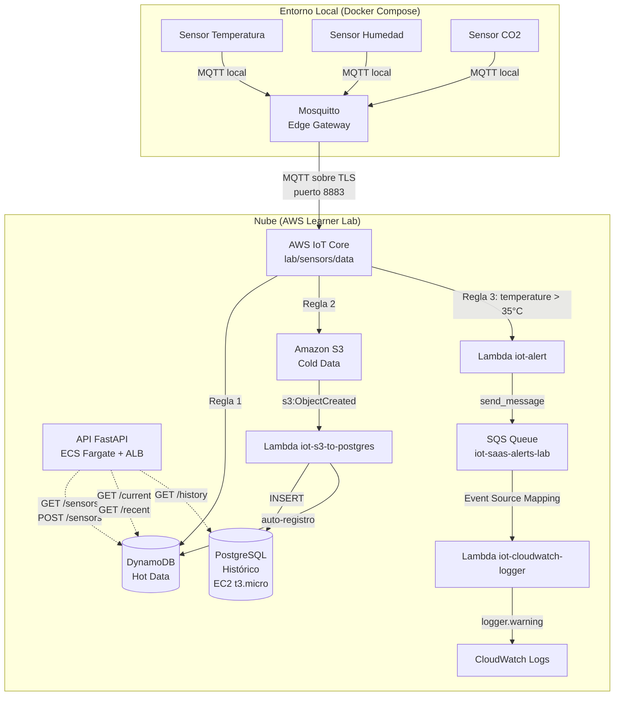

# IoT SaaS Platform on AWS

Real-time IoT platform built on AWS — MQTT sensors stream data through an edge gateway to IoT Core, which routes events to DynamoDB, S3, and a Lambda alert pipeline. A REST API deployed on ECS Fargate exposes sensor data from DynamoDB and a PostgreSQL historical store. Full infrastructure as code with Terraform.

**Stack:** Python · Mosquitto · AWS IoT Core · DynamoDB · S3 · Lambda · SQS · PostgreSQL · FastAPI · ECS Fargate · Terraform · Docker

---

## Architecture



---

## Quick Start

### Prerequisites

- Docker
- AWS credentials (Access Key ID, Secret, Session Token)
- Docker Hub account (only if you modify the API image)

### 1. Build the dev environment image

```bash
docker build -t iot-dev ./dev/
```

### 2. Deploy AWS infrastructure

Open a terminal inside the dev container with your AWS credentials and the project mounted:

```bash
docker run --rm -it \
  -e AWS_ACCESS_KEY_ID=<your-key> \
  -e AWS_SECRET_ACCESS_KEY=<your-secret> \
  -e AWS_SESSION_TOKEN=<your-token> \
  -e AWS_DEFAULT_REGION=us-east-1 \
  -v $(pwd):/workspace:Z \
  iot-dev bash
```

> **Fedora / SELinux:** the `:Z` flag is required for SELinux to allow the container to read/write the host directory.

Inside the container:

```bash
cd /workspace
make aws-up
```

This installs Lambda dependencies, runs `terraform init`, and applies the full infrastructure (~40 resources, ~5 minutes).

### 3. Start local sensors

In a second terminal on your host machine:

```bash
make local-up   # starts 3 sensors + Mosquitto gateway
make logs       # stream live sensor output
```

Sensors auto-register in DynamoDB the first time their data is processed by the Lambda pipeline — no manual setup needed.

### 4. Verify everything works

From inside the dev container:

```bash
bash /workspace/test_deploy.sh
```

Expected output: `RESULTADO: 17/17 OK — Todo funcionando ✓`

### 5. Tear down

```bash
# Inside dev container:
make aws-down

# On host:
make local-down
```

---

## API Endpoints

Base URL: `http://<alb-dns>.us-east-1.elb.amazonaws.com`  
Interactive docs: `http://<alb-dns>/docs`

| Method | Route | Description | Source |
|--------|-------|-------------|--------|
| `GET` | `/health` | Health check | — |
| `GET` | `/sensors` | List registered sensors | DynamoDB |
| `POST` | `/sensors` | Register a sensor | DynamoDB |
| `GET` | `/sensor/{id}/current` | Latest reading | DynamoDB |
| `GET` | `/sensor/{id}/recent` | Last 10 readings | DynamoDB |
| `GET` | `/sensor/{id}/history` | Full historical data | PostgreSQL |

Get the API URL after deploy:

```bash
cd terraform && terraform output api_url
```

---

## Makefile Reference

| Command | Description |
|---------|-------------|
| `make aws-up` | Install Lambda deps + `terraform apply` |
| `make aws-down` | `terraform destroy` |
| `make local-up` | Start sensors and gateway (`docker compose up`) |
| `make local-down` | Stop local containers |
| `make logs` | Stream sensor logs |
| `make push-api` | Build and push API image to Docker Hub |
| `make clean` | Destroy everything and remove generated files |

---

## Repository Structure

```
├── dev/                        ← Dev environment (Dockerfile + requirements)
├── python_device/              ← Sensor simulator (one process = one sensor)
├── edge_gateway/               ← Mosquitto broker with mTLS bridge to AWS
├── api/                        ← FastAPI REST API
├── lambda/
│   ├── s3_to_postgres/         ← S3 trigger → PostgreSQL INSERT
│   ├── alert/                  ← IoT Rule → SQS
│   └── cloudwatch_logger/      ← SQS → CloudWatch Logs
├── terraform/
│   ├── main.tf                 ← Orchestrates 8 modules
│   ├── variables.tf            ← All vars have defaults (no tfvars needed)
│   ├── data.tf                 ← Data sources: VPC, AMI, LabRole, IoT endpoint
│   └── modules/
│       ├── storage/            ← S3 bucket
│       ├── database/           ← DynamoDB (events + registry)
│       ├── networking/         ← Security groups + VPC S3 endpoint
│       ├── postgres/           ← EC2 t3.micro + PostgreSQL in Docker
│       ├── messaging/          ← SQS queue
│       ├── lambda/             ← 3 Lambda functions + triggers
│       ├── iot/                ← Thing, certs, 3 rules, mosquitto.conf
│       └── compute/            ← ECS Cluster + Task + ALB + Service
├── docker-compose.yml          ← 3 sensors + 1 gateway
├── Makefile
├── test_deploy.sh              ← Post-deploy verification script
└── SPEC.md                     ← Full technical documentation
```

---

## Terraform Variables

All variables have defaults — no `terraform.tfvars` needed.

| Variable | Default | Description |
|----------|---------|-------------|
| `project_name` | `iot-saas` | Prefix for all AWS resources |
| `environment` | `lab` | Environment suffix |
| `alert_threshold` | `35` | Temperature °C that triggers alerts |
| `postgres_password` | `iotpassword123` | PostgreSQL password |
| `api_image` | `jdavidruanob/iot-api:latest` | Docker Hub API image |

---

## Notes

- **AWS Learner Lab:** credentials expire every ~4 hours. Re-export them before each session. Terraform state persists between sessions so `apply` only updates what changed.
- **Sensor auto-registration:** sensors are automatically registered in the DynamoDB registry the first time their S3 data is processed by Lambda. No manual `POST /sensors` needed.
- **API image:** the image is published on Docker Hub. Only rebuild and push if you modify `api/main.py` or `api/Dockerfile`.
- For full technical documentation see [SPEC.md](SPEC.md).
